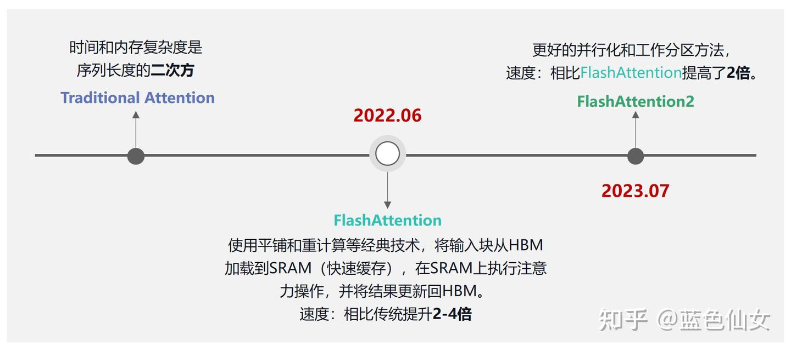
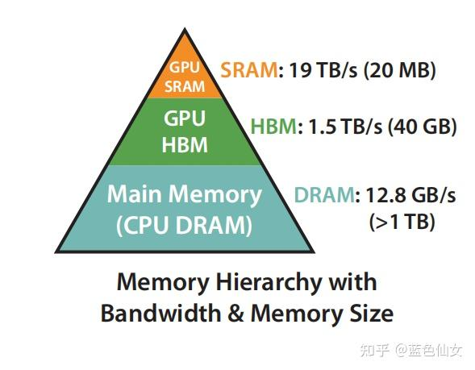
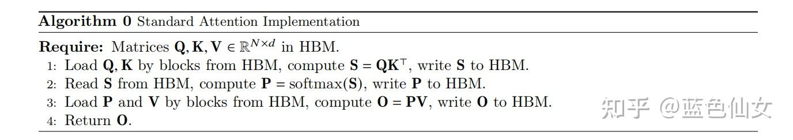
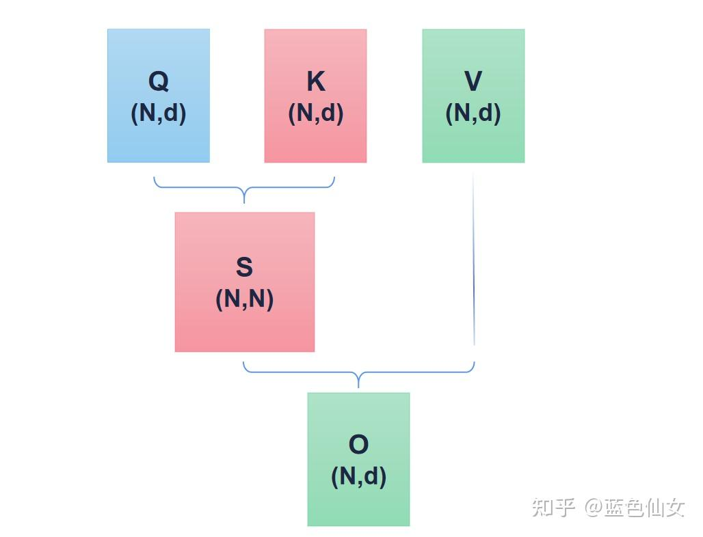
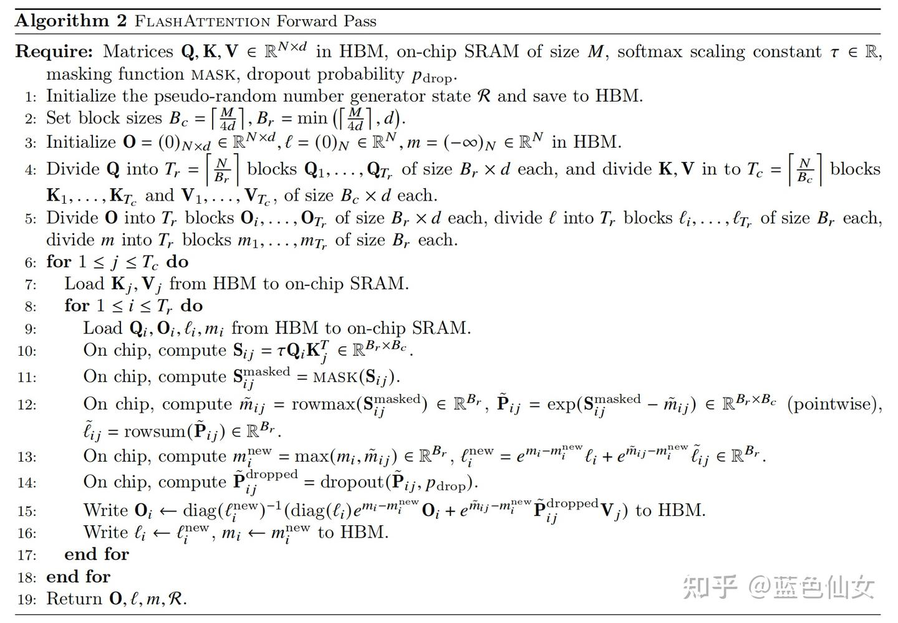
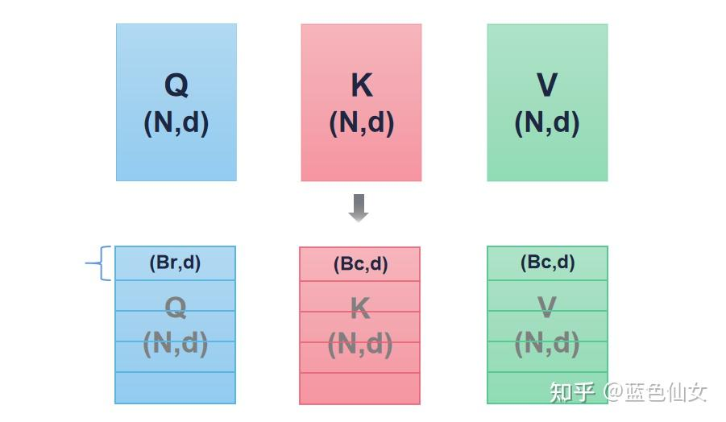
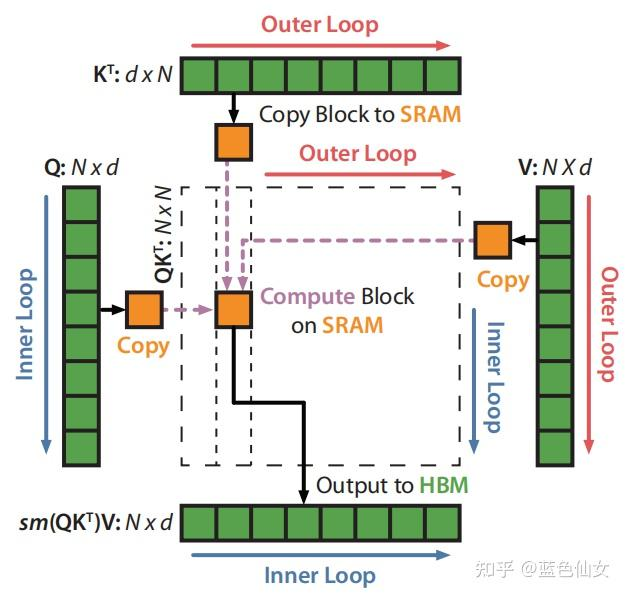
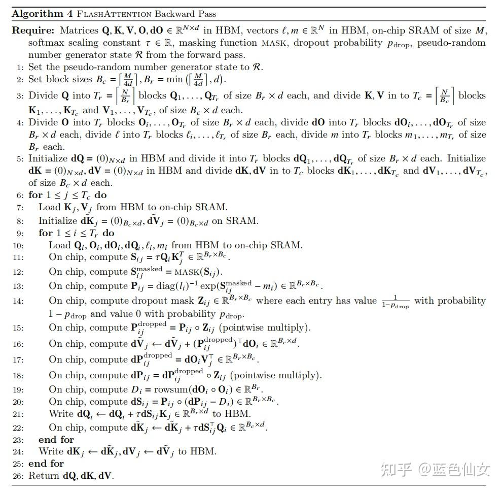

# Flash Attention

## 1. FlashAttention-大模型加速

论文《FlashAttention: Fast and Memory-Efficient Exact Attention with IO-Awareness》：[https://arxiv.org/abs/2205.14135](https://link.zhihu.com/?target=https%3A//arxiv.org/abs/2205.14135)

FlashAttention是一种加速注意力计算方法，目前已经应用在：[GPT-3](https://zhida.zhihu.com/search?content_id=238498031&content_type=Article&match_order=1&q=GPT-3&zhida_source=entity)、[Falcon2](https://zhida.zhihu.com/search?content_id=238498031&content_type=Article&match_order=1&q=Falcon2&zhida_source=entity)（阿联酋大模型）、[Llama2](https://zhida.zhihu.com/search?content_id=238498031&content_type=Article&match_order=1&q=Llama2&zhida_source=entity)、[Megatron-LM](https://zhida.zhihu.com/search?content_id=238498031&content_type=Article&match_order=1&q=Megatron-LM&zhida_source=entity)、GPT-4等知名LLM上。

Flash Attention已经集成到了[pytorch2.0](https://zhida.zhihu.com/search?content_id=238498031&content_type=Article&match_order=1&q=pytorch2.0&zhida_source=entity)中，可以很便捷的调用。

## 1.1 简介

FlashAttention旨在**加速**注意力计算并**减少内存占用**。FlashAttention利用底层硬件的内存层次知识，例如GPU的内存层次结构，来提高计算速度和减少内存访问开销。 FlashAttention的核心原理是通过将输入**分块**并在每个块上执行注意力操作，从而减少对高带宽内存（[HBM](https://zhida.zhihu.com/search?content_id=238498031&content_type=Article&match_order=1&q=HBM&zhida_source=entity)）的读写操作。具体而言，FlashAttention使用平铺和重计算等经典技术，将输入块从HBM加载到[SRAM](https://zhida.zhihu.com/search?content_id=238498031&content_type=Article&match_order=1&q=SRAM&zhida_source=entity)（快速缓存），在SRAM上执行注意力操作，并将结果更新回HBM。FlashAttention减少了内存读写量，从而实现了**2-4倍**的时钟时间加速。

**Timeline**: 最新的FlashAttention-2版本进一步优化了FlashAttention算法，使用了更好的并行化和工作分区方法，使得计算速度提高了2倍。FlashAttention-2还支持更高的头维数和多查询注意力等新特性，进一步提升了性能和灵活性。



### 1.2 动机

**Attention加速的[必要性]**：此处引用论文第一句：*“Transformers are **slow** and **memory-hungry** on long sequences, since the time and memory complexity of self-attention are **quadratic** in sequence length.”，*可以看出由于Transformer中self-attention 的时间和内存复杂度是序列长度的**二次方**，所以序列过长时，算法速度会变慢，需要消耗很高的内存。

## 2. 先验知识

**1) HBM（High Bandwidth Memory）和SRAM（Static Random-Access Memory）**

两种不同类型的计算机内存。

- HBM是一种高带宽内存接口，用于3D堆叠的SDRAM，具有较高的带宽和较低的功耗。
- SRAM是一种静态随机访问存储器，用于高速缓存等内部存储器，具有更快的访问速度和更低的延迟，但成本更高且占用更多芯片空间。

下图是GPU A100的内存分布：



图2 GPU A100的内存分布

**2） MAC**

MAC（Memory Access Cost，存储访问开销）是指在计算机系统中，访问内存或存储器所需的时间和资源开销。它是衡量计算机程序或算法性能的重要指标之一。 MAC的值取决于多个因素，包括内存层次结构、缓存命中率、内存带宽、存储器延迟等。较低的MAC值表示访问内存的开销较小，而较高的MAC值表示访问内存的开销较大。

## 3. FlashAttention原理

### 3.1 传统Attention回顾

对于输入序列 Q,K,V∈RN×d ，其中 N 是序列长度， d 是token尺寸， N≫d , self-attention计算输出 O∈RN×d，计算过程如公式1：

(1)S=QK⊤∈RN×N,P=softmax(S)∈RN×N,O=PV∈RN×d

标准注意力实现将矩阵 S 和 P 具体化为 HBM，这需要 O(N2) 内存，传统attention的流程如图:



图3

传统attention的图解如下：每次完整的矩阵运算的复杂度为 O(N2) ：



图4

### 3.2 FlashAttention算法

**核心思想**：传统减少HBM的访问，将QKV切分为小块后放入SRAM中

**核心方法**：tiling, recomputation

### **3.2.1 tiling(平铺):** 分块计算

因为Attention计算中涉及Softmax，所以不能简单的分块后直接计算。

【**回顾softmax**】softmax计算方法：
$$
softmax(xj)=exj∑i=1kexi
$$
softmax操作是row-wise的，即每行都算一次softmax，所以需要用到平铺算法来分块计算softmax。

【**safe softmax**】 原始softmax数值不稳定，为了数值稳定性，FlashAttention采用safe softmax，向量 ∈ R 的safe softmax 计算如下：

(3)m(x):=maxixi,f(x):=[ex1−m(x)…exB−m(x)],ℓ(x):=∑if(x)i,softmax(x):=f(x)ℓ(x)

同理，则 x=[x(1)x(2)]∈R2B 的softmax也可以通过分解计算：

(4)m(x)=m([x(1)x(2)])=max(m(x(1)),m(x(2))),f(x)=[em(x(1))−m(x)f(x(1))em(x(2))−m(x)f(x(2))],ℓ(x)=ℓ([x(1)x(2)])=em(x(1))−m(x)ℓ(x(1))+em(x(2))−m(x)ℓ(x(2)),softmax(x)=f(x)ℓ(x)

f(x)和l(x)都可以通过分块计算得出，所以FlashAttention在计算时通过分块将Q，K，V分块后，按块加载到内存中。

### 3.2.2 recomputation（重新计算）

FlashAttention算法的目标：在计算中减少显存占用，从O(N2) 大小降低到线性，这样就可以把数据加载到SRAM中，提高IO速度。

**解决方案**：传统Attention在计算中需要用到Q，K，V去计算S，P两个矩阵，FlashAttention引入softmax中的统计量 (m,ℓ) ，结合output O和在SRAM中的Q，K，V块进行计算。

### 3.3.3 算法细节

FlashAttention前向过程



图5

前向过程步骤详解：

- 1-5：主要在初始化和进行切分：



图6

- 6-7：遍历K，V的每一块（Outer Loop）
- 8：遍历Q的每一块 (Inner Loop)
- 9：将分块后的QKV的小块加载到SRAM (Copy Block to SRAM)
- 10：计算Sij (Compute Block on SRAM)
- 11：计算Sij mask (Compute Block on SRAM)
- 12：计算m,l统计量 (Compute Block on SRAM)
- 13：计算m,l统计量 (Compute Block on SRAM)
- 14：dropout (Compute Block on SRAM)
- 15：计算Oi并写入HBM (Output to HBM)
- 16：把li,mi写入HBM (Output to HBM)



图7

FlashAttention反向过程，反向传播也是通过引入统计量，实现分块计算：



图8

## 代码讲解

代码中列出了FlashAttention前向计算的步骤，便于大家理解，步骤与【图5】一一对应

```python
import torch

NEG_INF = -1e10  # -infinity
EPSILON = 1e-10

Q_LEN = 6
K_LEN = 6
Q_BLOCK_SIZE = 3
KV_BLOCK_SIZE = 3
P_DROP = 0.2

Tr = Q_LEN // Q_BLOCK_SIZE
Tc = K_LEN // KV_BLOCK_SIZE

Q = torch.randn(1, 1, Q_LEN, 4, requires_grad=True).to(device='cpu')
K = torch.randn(1, 1, K_LEN, 4, requires_grad=True).to(device='cpu')
V = torch.randn(1, 1, K_LEN, 4, requires_grad=True).to(device='cpu')

O = torch.zeros_like(Q, requires_grad=True)
l = torch.zeros(Q.shape[:-1])[..., None]
m = torch.ones(Q.shape[:-1])[..., None] * NEG_INF

# step 4
Q_BLOCKS = torch.split(Q, Q_BLOCK_SIZE, dim=2)
K_BLOCKS = torch.split(K, KV_BLOCK_SIZE, dim=2)
V_BLOCKS = torch.split(V, KV_BLOCK_SIZE, dim=2)

# step 5
O_BLOCKS = list(torch.split(O, Q_BLOCK_SIZE, dim=2))
l_BLOCKS = list(torch.split(l, Q_BLOCK_SIZE, dim=2))
m_BLOCKS = list(torch.split(m, Q_BLOCK_SIZE, dim=2))

# step 6
for j in range(Tc):
    # step 7
    Kj = K_BLOCKS[j]
    Vj = V_BLOCKS[j]
    # step 8
    for i in range(Tr):
        # step 9
        Qi = Q_BLOCKS[i]
        Oi = O_BLOCKS[i]
        li = l_BLOCKS[i]
        mi = m_BLOCKS[i]

        # step 10
        S_ij = torch.einsum('... i d, ... j d -> ... i j', Qi, Kj)

        # step 11
        mask = S_ij.ge(0.5)
        S_ij = torch.masked_fill(S_ij, mask, value=0)
        
        # step 12
        m_block_ij, _ = torch.max(S_ij, dim=-1, keepdims=True)
        P_ij = torch.exp(S_ij - m_block_ij)
        l_block_ij = torch.sum(P_ij, dim=-1, keepdims=True) + EPSILON
        P_ij_Vj = torch.einsum('... i j, ... j d -> ... i d', P_ij, Vj)

        # step 13
        mi_new = torch.maximum(m_block_ij, mi)

        li_new = torch.exp(mi - mi_new) * li + \
                 torch.exp(m_block_ij - mi_new) * l_block_ij

        # step 14
        m = torch.nn.Dropout(p=P_DROP)
        P_ij_Vj = m(P_ij_Vj)

        # Step 15
        O_BLOCKS[i] = (li / li_new) * torch.exp(mi - mi_new) * Oi \
                      + (torch.exp(m_block_ij - mi_new) / li_new) * P_ij_Vj
        print(f'-----------Attention : Q{i}xK{j}---------')
        print(O_BLOCKS[i].shape)
        print(O_BLOCKS[0])
        print(O_BLOCKS[1])
        print('\n')

        # step 16
        l_BLOCKS[i] = li_new
        m_BLOCKS[i] = mi_new

O = torch.cat(O_BLOCKS, dim=2)
l = torch.cat(l_BLOCKS, dim=2)
m = torch.cat(m_BLOCKS, dim=2)
```

程序输出：

```text
-----------Attention : Q0xK0---------
torch.Size([1, 1, 3, 4])
tensor([[[[ 1.1437, -0.7764, -1.0363,  0.0000],
          [ 0.9369, -0.1022, -1.2361,  0.6815],
          [ 0.4126,  0.0000, -0.7719,  0.7645]]]], grad_fn=<AddBackward0>)
tensor([[[[0., 0., 0., 0.],
          [0., 0., 0., 0.],
          [0., 0., 0., 0.]]]], grad_fn=<SplitBackward0>)


-----------Attention : Q1xK0---------
torch.Size([1, 1, 3, 4])
tensor([[[[ 1.1437, -0.7764, -1.0363,  0.0000],
          [ 0.9369, -0.1022, -1.2361,  0.6815],
          [ 0.4126,  0.0000, -0.7719,  0.7645]]]], grad_fn=<AddBackward0>)
tensor([[[[ 0.7545, -0.2443, -0.7402,  0.3747],
          [ 0.8182, -0.1734, -0.9327,  0.5013],
          [ 0.0000, -0.1735,  0.0000,  0.5015]]]], grad_fn=<AddBackward0>)


-----------Attention : Q0xK1---------
torch.Size([1, 1, 3, 4])
tensor([[[[ 0.8067, -0.3719, -0.4485,  0.0051],
          [ 0.5696, -0.4968, -0.7607,  0.1174],
          [ 0.3747,  0.0000, -0.5605,  0.3249]]]], grad_fn=<AddBackward0>)
tensor([[[[ 0.7545, -0.2443, -0.7402,  0.3747],
          [ 0.8182, -0.1734, -0.9327,  0.5013],
          [ 0.0000, -0.1735,  0.0000,  0.5015]]]], grad_fn=<AddBackward0>)


-----------Attention : Q1xK1---------
torch.Size([1, 1, 3, 4])
tensor([[[[ 0.8067, -0.3719, -0.4485,  0.0051],
          [ 0.5696, -0.4968, -0.7607,  0.1174],
          [ 0.3747,  0.0000, -0.5605,  0.3249]]]], grad_fn=<AddBackward0>)
tensor([[[[ 0.7783, -0.1672, -0.5975,  0.1221],
          [ 0.4484, -0.0950, -0.4860,  0.2646],
          [ 0.2525, -0.2205, -0.1091,  0.1687]]]], grad_fn=<AddBackward0>)
```

参考

1. [Flash Attention原理详解(含代码讲解)](https://zhuanlan.zhihu.com/p/676655352)
2. [【手撕LLM-Flash Attention】从softmax说起，保姆级超长文！！](https://zhuanlan.zhihu.com/p/663932651)