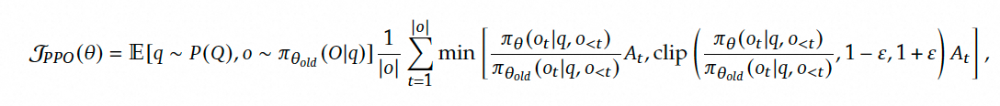

# GRPO

在deepseek-R1模型中，使用到的强化学习算法GRPO其实是DeepSeek之前的文章[《DeepSeekMath: Pushing the Limits of Mathematical Reasoning in Open Language Models》](https://arxiv.org/pdf/2402.03300)中所提及的Group Relative Policy Optimization。

## From PPO to GRPO

**Proximal Policy Optimization (PPO)** 是一种广泛使用的强化学习算法，尤其适用于对 LLMs 进行微调。PPO 的目标是通过最大化以下替代目标函数来优化策略模型：

## 参考

1. [详解DeepSeek-R1核心强化学习算法：GRPO](https://zhuanlan.zhihu.com/p/21046265072) 