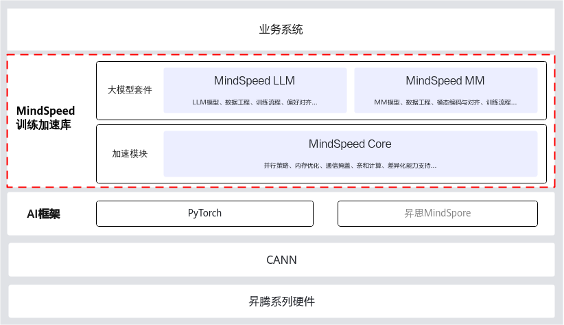

# MindSpeed

Megatron-LM、DeepSpeed与MindSpeed的主要区别：

- 计算平台适配性

  Megatron-LM主要针对GPU进行了深度优化，利用了CUDA和cuDNN等技术来加速训练过程。DeepSpeed生态更为强大，原生支持多种计算设备，包括昇腾计算设备。

  MindSpeed则是专为华为昇腾系列硬件设计的大模型训练加速库，兼容原生Megatron-LM框架，它不仅考虑到了硬件层面的亲和性，还结合了昇腾平台特有的软硬件特性进行了优化。

- 功能特性对比

  - 并行算法优化：三者都支持多种并行策略。此外，MindSpeed还提供了自动搜索最佳并行配置的能力。
  - 内存资源优化：DeepSpeed的ZeRO技术以其高效的显存管理著称；而Megatron-LM则利用混合精度和激活重计算等技术优化内存。相比之下，MindSpeed不仅提供了类似的内存压缩、复用功能，还引入了差异化的重计算技术，最大限度地减少对额外内存的需求。
  - 通信性能优化：MindSpeed为昇腾训练设备提供通算融合等策略，减少了通信延迟，提高了整体训练效率。

MindSpeed在此基础上进行一系列昇腾亲和优化，其核心优势体现在以下几个方面:

| 优势           | 说明                                                         |
| -------------- | ------------------------------------------------------------ |
| 并行算法优化   | 支持模型并行、专家并行、长序列并行等多维并行策略，针对昇腾软硬件架构进行亲和优化，显著提升了集群训练的性能和效率。 |
| 内存资源优化   | 提供内存压缩、复用，以及差异化的重计算技术，最大限度地利用内存资源，有效缓解内存瓶颈，提升训练效率。 |
| 通信性能优化   | 采用通算融合、通算掩盖等策略，配合高效的算网协同机制，大幅提高算力利用率，减少通信延迟，优化整体训练性能。 |
| 计算性能优化   | 集成高性能融合算子库，结合昇腾亲和的计算优化，充分释放昇腾算力，显著提升计算效率。 |
| 差异化能力支持 | 在长序列、权重保存、并行策略自动搜索等场景提供差异化能力。   |

# 参考

1. [昇腾社区MindSpeed](https://www.hiascend.com/software/mindspeed)