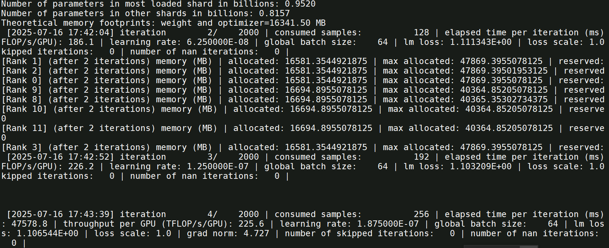

# Qwen2.5-7B适配


## 依赖安装

**pytorch后端相关依赖环境与mindspore环境互相冲突，请根据需要，择一安装。**

### Pytorch后端相关依赖安装

请参考MindSpeed-LLM仓首页[“版本配套表”](../README.md#版本配套表)，准备[torch_npu](https://www.hiascend.com/developer/download/community/result?module=pt)和[apex](https://gitee.com/ascend/apex)，参考[Ascend Extension for PyTorch](https://www.hiascend.com/document/detail/zh/Pytorch/700/configandinstg/instg/insg_0001.html)或执行以下命令安装

```shell
# 安装torch和torch_npu，因为版本迭代，包名存在出入，根据实际修改
wget https://download.pytorch.org/whl/cpu/torch-2.1.0-cp38-cp38-manylinux_2_17_aarch64.manylinux2014_aarch64.whl
pip install torch-2.1.0-cp38-cp38-manylinux_2_17_aarch64.manylinux2014_aarch64.whl
wget https://gitee.com/ascend/pytorch/releases/download/v7.0.0-pytorch2.1.0/torch_npu-2.1.0.post12-cp38-cp38-manylinux_2_17_aarch64.manylinux2014_aarch64.whl
pip install torch_npu-2.1.0.post12-cp38-cp38-manylinux_2_17_aarch64.manylinux2014_aarch64.whl

# apex for Ascend 需要自行参考 https://gitee.com/ascend/apex 完成whl包的构建，再通过如下指令完成安装
pip install apex-*.whl
```

拉取代码仓并完成安装:
```shell
# 设置环境变量
source /usr/local/Ascend/ascend-toolkit/set_env.sh
source /usr/local/Ascend/nnal/atb/set_env.sh

# 安装MindSpeed加速库
git clone https://gitee.com/ascend/MindSpeed.git
cd MindSpeed
git checkout 2.0.0_core_r0.8.0  # checkout commit from MindSpeed 2.0.0_core_r0.8.0
pip install -r requirements.txt 
pip3 install -e .
cd ..

# 准备MindSpeed-LLM及Megatron-LM源码
git clone https://gitee.com/ascend/MindSpeed-LLM.git 
git clone https://github.com/NVIDIA/Megatron-LM.git  # megatron从github下载，请确保网络能访问
cd Megatron-LM
git checkout core_r0.8.0
cp -r megatron ../MindSpeed-LLM/
cd ../MindSpeed-LLM
git checkout 2.0.0

pip install -r requirements.txt  # 安装其余依赖库
```

## 创建容器
```bash
docker run -dit -u root --ipc=host --network host --privileged \
    --name 'llm_qwen2.5-7B' \
    --device=/dev/davinci0 \
    --device=/dev/davinci1 \
    --device=/dev/davinci2 \
    --device=/dev/davinci3 \
    --device=/dev/davinci4 \
    --device=/dev/davinci5 \
    --device=/dev/davinci6 \
    --device=/dev/davinci7 \
    --device=/dev/davinci8 \
    --device=/dev/davinci9 \
    --device=/dev/davinci10 \
    --device=/dev/davinci11 \
    --device=/dev/davinci12 \
    --device=/dev/davinci13 \
    --device=/dev/davinci14 \
    --device=/dev/davinci15 \
    --device=/dev/davinci_manager \
    --device=/dev/devmm_svm \
    --device=/dev/hisi_hdc \
    -v /usr/local/Ascend/driver:/usr/local/Ascend/driver \
    -v /usr/local/Ascend/firmware:/usr/local/Ascend/firmware \
    -v /usr/local/Ascend/add-ons/:/usr/local/Ascend/add-ons/ \
    -v /usr/local/sbin/:/usr/local/sbin/ \
    -v /usr/bin/hccn_tool:/usr/bin/hccn_tool \
    -v /var/log/npu/conf/slog/slog.conf:/var/log/npu/conf/slog/slog.conf \
    -v /apps:/apps \
    -v /home:/home \
    a3_llm:v2.0 bash
```

生效CANN的环境变量
```
source /usr/local/Ascend/ascend-toolkit/set_env.sh
source /usr/local/Ascend/nnal/atb/set_env.sh
```

进入 MindSpeed-LLM的代码目录
```
cd /usr/local/Ascend/llm-train/MindSpeed-LLM
```

## 预训练
### 3.1 权重转换

昇腾MindSpeed-LLM要求模型权重采用Megatron-LM格式，在这里我们将原始HuggingFace权重格式转换为Megatron-Mcore格式。
详见[hf2mg权重转换](./pytorch/solutions/checkpoint_convert.md#21-huggingface权重转换到megatron-lm格式)

使用官方提供的转换脚本，获取对应切分的mg权重。

```bash
# 请先根据如下指导完成脚本修改配置
bash examples/mcore/qwen25/ckpt_convert_qwen25_hf2mcore.sh
```

如下为调整后的hf2mcore权重转换示例脚本

```bash
# 修改 ascend-toolkit 路径
source /usr/local/Ascend/ascend-toolkit/set_env.sh

# 设置需要的权重转换参数
python convert_ckpt.py \
       --use-mcore-models \
       --model-type GPT \
       --load-model-type hf \
       --save-model-type mg \
       --target-tensor-parallel-size 4 \
       --target-pipeline-parallel-size 2 \
       --add-qkv-bias \
       --load-dir /apps/hw/weights/Qwen2.5-7B/ \
       --save-dir ./model_weights/qwen2.5_mcore/ \
       --tokenizer-model /apps/hw/weights/Qwen2.5-7B/tokenizer.json \
       --model-type-hf llama2 \
       --params-dtype bf16 # --num-layer-list 11, 13, 19, 21 参数根据需要添加
```

参数解析

| 参数                                  | 说明                                                         | 必填 |
|-------------------------------------|------------------------------------------------------------|---|
| `--model-type GPT`                  | 指定模型类型为GPT系列                                               | ✅ |
| `--use-mcore-models`                | 转换为Megatron-Mcore格式                        | ✅ |
| `--target-tensor-parallel-size 1`   | 张量并行度设置（建议配置1）                                             | ✅ |
| `--target-pipeline-parallel-size 4` | 流水线并行度设置（建议保持4）                                            | ✅ |
| `--tokenizer-model`                 | 指定分词器路径                                                    | ✅ |
| `--load-model-type`                 | 加载权重的类别（可以是hf、mg）                                          | ✅ |
| `--save-model-type`                 | 存储权重的类别（可以是hf、mg）                                          | ✅ |
| `--load-dir`                 | 权重文件加载路径                                          | ✅ |
| `--save-dir`                 | 权重文件保存路径                                          | ✅ |
| `--model-type-hf`                 | huggingface模型类别，默认为llama2                                  |   |
| `--params-dtype`                 | 指定权重转换后的权重精度模式，默认为fp16，如果源文件格式为bf16，则需要设置为bf16 | ✅  |

- 注意：对该qwen2.5-7b模型，此处推荐的切分配置是tp1pp4，对应上述配置。

### 3.2 预训练数据集处理

通过对各种格式的数据做提前预处理，避免原始数据的反复处理加载，将所有的数据都统一存储到为.bin和.idx两个文件中，详见[预训练数据处理](./pytorch/solutions/pretrain/pretrain_dataset.md)

常用的预训练数据集包括alpaca、enwiki、c4等，链接中提供了数据集下载地址。

### 预训练数据集下载

如下以alpaca数据集为例，进行预训练数据集示例。

```shell
# 根据链接提供地址，通过wget获取数据集元数据
mkdir dataset
cd dataset/
wget https://huggingface.co/datasets/tatsu-lab/alpaca/blob/main/data/train-00000-of-00001-a09b74b3ef9c3b56.parquet
cd ..

# 使用仓库提供的数据处理脚本，获取预训练数据集。
# 请根据如下指导完成脚本修改配置
bash examples/mcore/qwen25/data_convert_qwen25_pretrain.sh
```
data_convert_qwen25_pretrain.sh中的配置需做如下修改：
```shell
# 请按照您的真实环境修改 set_env.sh 路径
source /usr/local/Ascend/ascend-toolkit/set_env.sh

python ./preprocess_data.py \
	--input /apps/hw/datasets/train-00000-of-00001-a09b74b3ef9c3b56.parquet \
	--tokenizer-name-or-path /apps/hw/weights/Qwen2.5-7B/ \     
	--output-prefix ./datasets/alpaca \     
	--tokenizer-type PretrainedFromHF \
	--workers 4 \
	--log-interval 1000
 # 预训练数据集会生成alpaca_text_document.bin和.idx
```

参数解析

| 参数                       | 说明                                                               | 必填 |
|---------------------------|------------------------------------------------------------------|--|
| `--input`                 | 支持输入数据集目录或文件，目录则处理全部文件, 支持.parquet、.csv、.json、.jsonl、.txt、.arrow格式，同一目录要求数据格式保持一致 | ✅ |
| `--tokenizer-type` | 说明使用tokenizer类别，参数值为PretrainedFromHF时，词表路径填写模型目录即可               | ✅ |
| `--tokenizer-name-or-path`| 配合tokenizer-type，目标模型的tokenizer原数据文件夹，用于数据集的转换                   |  |
| `--tokenizer-model`       | 配合指定分词器模型的路径，路径具体到tokenizer.model文件                              |  |
| `--output-prefix`  | 转换后输出的数据集文件的文件名前缀                                                | ✅ |
| `--workers`               | 多进程数据集处理                                                         | ✅ |

### 3.3 预训练任务启动

完成了数据集处理和权重转换之后，可以开始拉起预训练任务。

#### 启动单机预训练

##### 配置预训练参数

 ```shell
# 打开示例脚本
vim examples/mcore/qwen25/pretrain_qwen25_7b_32k_ptd.sh

# 单机配置如下
NPUS_PER_NODE=8           # 使用单节点的8卡NPU
MASTER_ADDR=locahost      # 以本节点ip地址为master_ip
MASTER_PORT=6000          # 本节点端口号为6000
NNODES=1                  # 单机，即一台节点，多机即多节点
NODE_RANK=0               # 单机RANK为0，多机为(0,NNODES-1)，不同节点不可重复
WORLD_SIZE=$(($GPUS_PER_NODE * $NNODES))

# 根据实际情况配置权重保存、权重加载、词表、数据集路径
CKPT_LOAD_DIR="./model_weights/qwen2.5_mcore/"  # 权重加载路径，填入权重转换时保存的权重路径
CKPT_SAVE_DIR="./ckpt/qwen25-7b"                # 训练完成后的权重保存路径
DATA_PATH="./datasets/alpaca_text_document"      # 数据集路径，填入数据预处理时保存的数据路径，注意需要添加后缀
TOKENIZER_PATH="/apps/hw/weights/Qwen2.5-7B/" # 词表路径，填入下载的开源权重词表路径

TP=4                # 权重转换设置--target-tensor-parallel-size 1，修改为1
PP=2                # 权重转换设置--target-pipeline-parallel-size 4，修改为4，与权重转换时一致
SEQ_LEN=4096        # 修改seq_length为4096 
MBS=1               # 设置micro-batch-size为1
GBS=64              # 设置global-batch-size为64

# 完成如上修改后保存关闭脚本
 ```

```shell
# 初始化环境变量
source /usr/local/Ascend/ascend-toolkit/set_env.sh
source /usr/local/Ascend/nnal/atb/set_env.sh

# 启动预训练脚本
bash examples/mcore/qwen25/pretrain_qwen25_7b_32k_ptd.sh
```



脚本中特性包含训练参数也包含优化特性，如下部分参数解释

| 参数名                                     | 说明                              |
|-----------------------------------------|---------------------------------| 
| `--use-mcore-models`                    | 使用mcore分支运行模型     |          
| `--disable-bias-linear`                 | 去掉linear的偏移值，与qwen原模型一致         | 
| `--add-qkv-bias`                        | 增加Q、K、V的偏移值，是权重的组成部分            | 
| `--group-query-attention`               | 开启GQA注意力处理机制                    |
| `--num-query-groups 4`                  | 配合GQA使用，设置groups为4              |
| `--position-embedding-type rope`        | 位置编码采用rope方案                    |
| `--untie-embeddings-and-output-weights` | 根据原模型要求将output层和embedding层的权重解耦 |
| `--bf16`                                | 昇腾芯片对BF16精度支持良好，可显著提升训练速度       |

#### 启动多机预训练任务

如果需要启动多机预训练任务，那么在单机预训练脚本的基础上，做如下修改，

##### 配置预训练参数

 ```shell
# vi examples/mcore/qwen25/pretrain_qwen25_7b_32k_ptd.sh 打开示例脚本

# 单机配置如下
NPUS_PER_NODE=8           # 同单机
MASTER_ADDR=${master_ip}  # 参与多机训练的节点都配置为master_ip
MASTER_PORT=6000          # 本节点端口号为6000
NNODES=1                  # 根据参与节点数量配置
NODE_RANK=0               # 多机为(0,NNODES-1)，不同节点不可重复，master_node rank为0，其ip为master_ip
WORLD_SIZE=$(($GPUS_PER_NODE * $NNODES))

# 参与节点都要有如下数据
CKPT_LOAD_DIR="./model_weights/qwen2.5_mcore/"  
CKPT_SAVE_DIR="./ckpt/qwen25-7b"                
DATA_PATH="./dataset/alpaca_text_document"      
TOKENIZER_PATH="./model_from_hf/qwen2.5-7b-hf/"
 ```

**注意**：

- 多机训练需在多个终端同时启动预训练脚本(每个终端的预训练脚本只有NODE_RANK参数不同，其他参数均相同)
- 如果使用多机训练，且没有设置数据共享，需要在训练启动脚本中增加`--no-shared-storage`参数，设置此参数之后将会根据布式参数判断非主节点是否需要load数据，并检查相应缓存和生成数据

