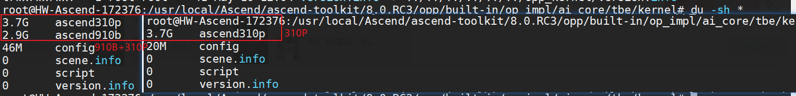

# 昇腾CANN

> CANN [社区官方文档](https://www.hiascend.com/document/detail/zh/canncommercial/82RC1/index/index.html)
>
> * [集合通信](https://www.hiascend.com/document/detail/zh/canncommercial/81RC1/apiref/envvar/envref_07_0144.html)

## CANN镜像

> 1. 昇腾镜像仓库 : https://www.hiascend.com/developer/ascendhub/detail/17da20d1c2b6493cb38765adeba85884
> 2. CANN镜像制作代码仓库: https://github.com/Ascend/cann-container-image

创建容器：
```
# 假设您的NPU设备安装在/dev/davinci1上，并且您的NPU驱动程序安装在/usr/local/Ascend上：
docker run \
    --name cann_container \
    --device /dev/davinci1 \
    --device /dev/davinci_manager \
    --device /dev/devmm_svm \
    --device /dev/hisi_hdc \
    -v /usr/local/dcmi:/usr/local/dcmi \
    -v /usr/local/bin/npu-smi:/usr/local/bin/npu-smi \
    -v /usr/local/Ascend/driver/lib64/:/usr/local/Ascend/driver/lib64/ \
    -v /usr/local/Ascend/driver/version.info:/usr/local/Ascend/driver/version.info \
    -v /etc/ascend_install.info:/etc/ascend_install.info \
    -it ascend/cann:tag bash
```

## CANN安装

> 参考：[安装CANN](https://www.hiascend.com/document/detail/zh/canncommercial/82RC1/softwareinst/instg/instg_0008.html?Mode=PmIns&InstallType=local&OS=Debian&Software=cannToolKit)

```
2.1G    Ascend-cann-kernels-310p_8.0.RC3_linux-aarch64.run
1.9G    Ascend-cann-toolkit_8.0.RC3_linux-aarch64.run
```

### 安装 cann-toolkit
执行以下命令安装软件（以下命令支持--install-path=<path>等参数，具体参数说明请参见参数说明）。
```
./Ascend-cann-toolkit_8.0.RC3_linux-aarch64.run --install
```

静默安装
```
./Ascend-cann-toolkit_8.0.RC3_linux-aarch64.run --install --quiet --nox11
```

生效环境变量

```
source /usr/local/Ascend/ascend-toolkit/set_env.sh
```

### 安装 cann-kernels

```
./Ascend-cann-kernels-310p_8.0.RC3_linux-aarch64.run --install
```

静默安装
```
./Ascend-cann-kernels-310p_8.0.RC3_linux-aarch64.run --install --quiet --nox11
```

生效环境变量

```
source /usr/local/Ascend/ascend-toolkit/set_env.sh
```

### 安装 nnal -ATB算子加速库（按需）

参考：[安装加速库](https://www.hiascend.com/document/detail/zh/mindie/10RC2/envdeployment/instg/mindie_instg_0014.html)

检查完整性

```
./Ascend-cann-nnal_8.2.RC1_linux-aarch64.run --check
```

一般安装

```
./Ascend-cann-nnal_8.2.RC1_linux-aarch64.run --install
```

静默安装

```
./Ascend-cann-nnal_8.2.RC1_linux-aarch64.run  --install --quiet --nox11
```

生效环境变量

```
source /usr/local/Ascend/nnal/atb/set_env.sh
```

## CANN目录下文件

```
root@HW-Ascend-172376:/usr/local/Ascend/ascend-toolkit/8.0.RC3# du -sh *
1.5G    aarch64-linux
0       acllib
0       arm64-linux
28K     atc
0       bin
4.0K    cann_uninstall.sh
24K     combo_script
1.5M    compiler
0       conf
8.0K    create_version_softlink.sh
28K     fwkacllib
536K    hccl
0       include
0       lib64
228K    mindstudio-toolkit
7.3G    opp #算子实现文件，
864K    opp_kernel
0       ops
28K     pyACL
81M     python
50M     runtime
0       test-ops
257M    toolkit
603M    tools
8.0K    var
```

cann-kernels包主要安装在 `/usr/local/Ascend/ascend-toolkit/8.0.RC3/opp/built-in/op_impl/ai_core/tbe/kernel`。安装后，在该目录下会多一个 ascend310p 或 ascend910b 的目录

