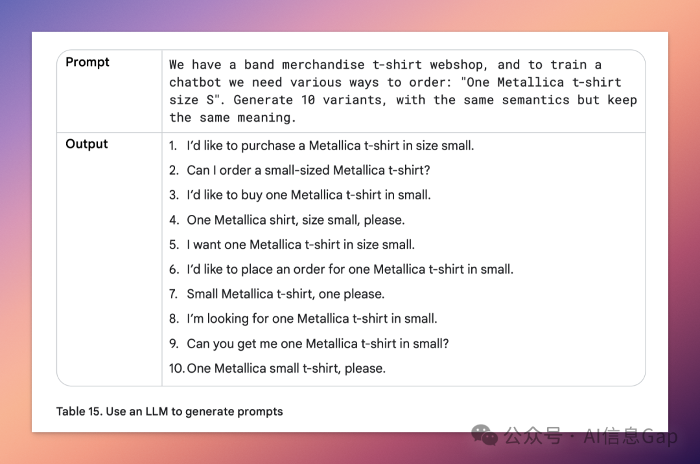

# 提示词工程

### **01｜提示词是控制 AI 模型的一组「参数化指令」**

先讲核心观念：提示词 ≠ 自然语言提示，它其实是 **配置语言模型行为** 的一组“组合拳”，包括：

- 提示词本身（语句、结构、范式）
- 输出参数（温度、top-k、top-p）
- 调用方式（system/role/context prompting）
- 示例数量（zero-shot / one-shot / few-shot）
- 模型选择（GPT / Claude / Gemini / DeepSeek 等）
- 配套机制（JSON schema、CoT、ReAct、ToT）

提示词是一个工程动作，不是灵光乍现。

和开发一款软件产品一样，你需要不停调试，记录每次的配置、输入、输出，然后逐步调优出最稳定、最准确、高可复用的版本。

而提示工程的目标，不是“写得多像人”，而是“**写得最能让模型给出符合你预期的答案**”。

------

### **02｜“温度没调对，全场白忙活”**

你是不是也遇到过这种情况：

明明提示词写得挺认真，模型却“口吐莲花”疯狂跑题；或者你想它多发散一些，它却始终一本正经、言简意赅，跟你想要的完全对不上。

有时候可能问题不在提示词本身，而在——**模型的配置参数**。

谷歌在这份白皮书里用了将近一整章讲这件事，而且讲得非常系统化和工程化。

AI 模型的关键参数共有三个。

- **温度（temperature）**：决定它是“理性答题”，还是“激情发散”。低温稳、高温飘。
- **top-k / top-p**：调控它“选词自由度”的两个开关，不懂也没事，默认一般都能用。
- **max tokens**：不设上限，它可能说个没完；太短，它又容易截断。

下面是一组谷歌给出的推荐搭配。

| 任务类型                   | 推荐值                              |
| :------------------------- | :---------------------------------- |
| 写报告、数据处理这些要准的 | 温度调低一点（0.2 左右）            |
| 写文案、做创意             | 放开点，温度 0.9 左右               |
| 有唯一标准答案的任务       | 温度设成 0，top-k=1，别让它自由发挥 |

------

### **03｜Prompt，不止多写几句那么简单**

提示词，不只是“写一句有技巧的话”。

谷歌白皮书这样告诉我们：

> 提示词是一种结构化的工程输入方式。

------

**示例引导型：zero-shot / one-shot / few-shot**

这是最基础也最好理解的：

- 零示例（zero-shot）适合模型训练数据里就见过类似任务的场景；
- 单示例（one-shot）能帮它理解你想要的格式和风格；
- 多示例（few-shot）则是“人类教师式喂养”，加稳加准加控制输出结构。

但也讲究“活学活用”，比如分类任务的多示例提示词，一定要打乱标签顺序，否则模型容易“看例子学顺序”，影响泛化能力。

------

**身份设定型：System / Role / Context Prompting**

这一类技巧大概率你已经在用，只是可能没系统命名过。

- System Prompt 是“总任务描述”；
- Role Prompt 是“你现在是谁”；
- Context Prompt 是“你现在知道了什么”。

谷歌建议：**三者叠加用，效果翻倍。**

你让它做个“审计专家 + 已知公司上下文 + 要求输出 JSON 的结构化表格”，整个输出就从“作文”变成“格式化系统接口”。

------

**推理引导型技巧：让它不直接答，而是先思考**

推理引导型技巧包括五种玩法，分别适合不同类型的复杂任务。

| 技术名                  | 用法精髓             | 场景示例             |
| :---------------------- | :------------------- | :------------------- |
| Chain of Thought（CoT） | “想一想再答”         | 数学题、复杂逻辑     |
| Step-back Prompting     | 先问泛化问题，再入手 | 写内容前先出思路     |
| Self-consistency        | 多次采样，多数投票   | 稳定性敏感任务       |
| Tree of Thoughts（ToT） | 多路径探索           | 创意写作、复杂决策   |
| ReAct                   | 推理 + 工具调用      | 搜索、API 自动化流程 |

举个最常见的 CoT 例子。

> Let’s think step by step.

------

**让模型自己写 prompt**

让模型自己写提示词，**Automatic Prompt Engineering（APE）**，怎么理解？

其实就是你告诉模型你的需求和目标，让模型自己来写提示词，从它写出来的提示词里挑最好的留下来，并且还能进一步调试优化。

这种玩法特别适合“用 AI 训练 AI”的场景，比如生成对话语料、覆盖各种场景、构造训练数据集。非常省心，效果也很可控，实测真香。

------

### **04｜三条提示词规则**

最后，总结三条很重要但容易被忽略的提示词规则。

1. **提示词要像代码一样管理：版本要记录，修改要有注释。**

   推荐用表格 + 工程笔记方式整理。

2. **尽量用正向指令，而不是列限制条件。**

   “请直接输出 JSON 格式”，比“不要生成段落文字”更清晰有效。

3. **输入方式影响比你想象的大得多。**

   同一个任务，你用问句、命令句、甚至模板化输入，模型的行为完全不同。

> 提示工程的尽头，是提示词写得越来越短，参数调得越来越对，场景理解越来越清晰。

## 有益参考 

1. Google提示工程白皮书《Prompt Engineering》: https://www.promptingguide.ai/zh