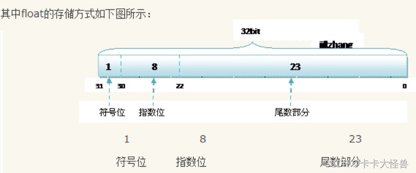
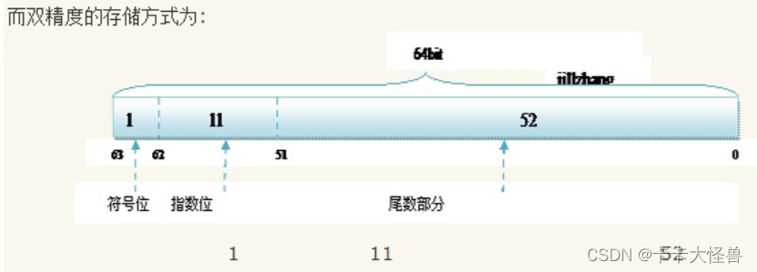
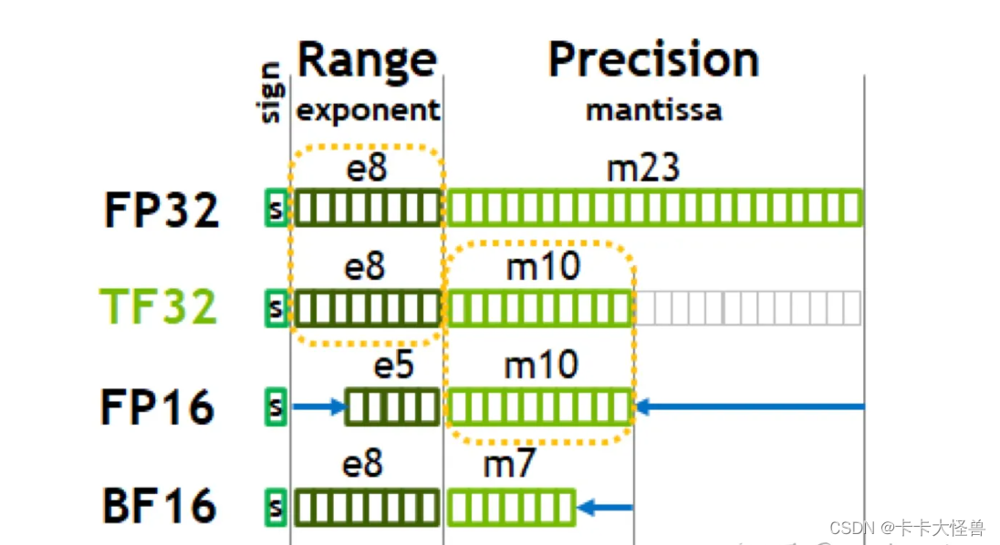

## 数据格式与精度

> FP32，TF32，FP16，BF16

## 一、什么是浮点型数值

浮点数是一种数据类型，指有小数点的实数。以二进制存储在计算机中时，包括符号位，指数位和小数位（尾数位）。
浮点型简单讲就是实数的意思。浮点数在计算机中用以近似表示任意某个实数。具体的说，这个实数由一个整数或定点数(即尾数)乘以某个基数(计算机中通常是 2)的整数次幂得到，这种表示方法类似于基数为 10 的科学记数法。

浮点型数据分为：单精度（float，4字节，32比特）与双精度（double，8字节，64位比特）

不同于定点数，浮点型数据以二进制存储在计算机中，因此计算时一般都是有误差，都是近似。（一般期望两个浮点型的误差相互抵消，所以一般使用同类型的浮点数进行相互计算）
例：0.1用二进制表示，将是一个无限循环小数，因此会出现舍入误差，造成精度损失。

#### 进制相互转换：

1）整数十进制转化为二进制：除2取余数
2）小数位十进制转化为二进制：乘2取整数(对0.125求二进制：0.125 乘以 2 等于 0.25，整数位为0；0.25乘以2为0.5，整数为0，0.5乘以2等于1，整数位为1，所以停止运算。0.125的二进制为0.001。)
3）小数位二进制转化为十进制：小数点后第一位上的二进制数字乘以2的负一次方加上第二位上的二进制数字乘以2的负二次方，以此类推。

#### 浮点型数据如何存储：

float为32比特，三个部分组成。第1位表示符号（正负），第2到第9位表示指数，后23位表示尾数。
以float 2.5为例：
2的二进制为10，0.5的二进制为1，因此2.5的二进制为10.1，可以改写为1.01 x 2^1。所以尾数部分为0100 0000 0000 0000 0000 000，共23位。指数为1，偏移量为127，所以指数部分需要1 + 127 = 128的二进制，即 10000000.所以float2.5保存在计算机中为：0 10000000 01000000000000000000000 。
（为什么还要加上偏移量127。因为指数部分为8比特，即0-255，但指数还存在正负，所以为-127-128，为了同时表示正负指数以及它们的大小，所以需要加上127）

double类型为64比特，计算方法与float类似，只不过指数的偏移量为1023

5的特殊情况：比如float 16777216，它与0.1类似，尾数超出了计算机存储的限制。
16777216 = 1.000000000000000000000001 x 2^24。可以发现尾数有24位，但float的尾数只能存储23位，所以存储时最后一个1就舍去了，造成精度问题。但由于指数位置保存的数24，所以在计算时会默认那个被抛弃的尾数当0处理，所以存储的值和你认为的值是存在误差的

由上述5，6可知，无论是float，还是double都有一个取值范围。
float的有效数字为一般7位，即由于尾数位的限制，单精度浮点数通常能够保证大约7位十进制数的精度。（并不是说当float有效数字为8位时，一定会出现精度问题，只是最好是7位）
double一般为15位

#### float与double区别：

double类型精度高，范围大，但时存储和计算效率相较于float会差一些。因此在处理大量数据时，float性能会更好，更有效率。而我们一般使用float就够了，数值的范围不需要那么大/

#### float与double范围和精度

##### 范围

float和double的范围是由指数的位数来决定的。(因为表示的时候都是1.x * 2^Y的形式，所以忽略了1.x的效果，直接取指数表示浮点数的范围)
float：1bit(符号位) 8bits(指数位) 23bits(尾数位)
double：1bit(符号位) 11bits(指数位) 52bits(尾数位)
于是，float的指数范围为-127+128，而double的指数范围为-1023+1024。
其中负指数决定了浮点数所能表达的绝对值最小的非零数；而正指数决定了浮点数所能表达的绝对值最大的数，也即决定了浮点数的取值范围。
**float的范围为：-2^128 ~ +2^128，也即-3.40E+38 ~ +3.40E+38；**
**double的范围为：-2^1024 ~ +2^1024，也即-1.79E+308 ~ +1.79E+308。**

##### 精度

float和double的精度是由尾数的位数来决定的，尾数越多能表示的小数点后面有效数字就越多，因此精度就越高。浮点数在内存中是按科学计数法来存储的，其整数部分始终是一个隐含着的“1”，由于它是不变的，故不能对精度造成影响。
**float：2^23 = 8388608，一共七位，这意味着最多能有 7 位有效数字，但绝对能保证的为 6 位，也即float的精度为 6~7 位有效数字；**
**double：2^52 = 4503599627370496，一共 16 位，同理，double的精度为 15~16 位。**

#### 为什么要用偏移量的方式来计算指数？

如果不采用偏移量的方式：
8 位 2 进制数表示的有符号数范围有两个区间：0000 0000~0111 1111和1000 0000~1111 1111，分别为+0和-0。
大家看到这里的问题了吧，有两个 0 ，一个正 0 和一个负 0。
如果采用偏移量的方式：
127 转化为二进制是：0111 1111
当我们要表示 -127，则有127-127即0111 1111 - 0111 1111 = 0000 0000
当我们要表示 -126，则有127-126即0111 1111 - 0111 1110 = 0000 0001
当我们要表示 -2，则有127-2即0111 1111 - 0000 0010 = 0111 1101
当我们要表示 -1，则有127-1即0111 1111 - 0000 0001 = 0111 1110
当我们要表示 0，则有0+127即0000 0000 + 0111 1111 = 0111 1111
当我们要表示 1，则有1+127即0000 0001 + 0111 1111 = 1000 0000
当我们要表示 2，则有1+127即0000 0010 + 0111 1111 = 1000 0001
当我们要表示128，则有128+127即1000 0000 + 0111 1111 = 1111 1111
由上面的例子，我们可以得出规律，采用移位存储技术，我们可以使用 8 位二进制来表示从-127~+128共计 127 个负数+零(0)+ 128 个正数总共 256 个数，看来使用移位存储既没有 +0 和 -0 的问题，又能充分使用新生成的8位二进制数最大限度的表示单精度浮点数的幂指数，是非常合理的。

## 二、新数据类型FP32，TF32，FP16，BF16

在这个算力紧缺的时代，需要在精度与性能之间做取舍。

nvidia白皮书推出FP32，TF32，FP16，BF16都是存储浮点型数据的新数据类型（FP32就是float），通过牺牲精度于范围来提升性能。与单精度浮点型相比吗，它们只需要一半的存储空间和带宽。

NV推出的这几个新数据类型也只是在位的分配上有所不同：1）通过缩小指数位位宽来降低数值范围 。2）通过缩小尾数位宽来缩小精度范围。从而降低了整个深度学习计算负载的大小。

常被广泛使用，舍弃一点精度可以换取计算效率的大幅度上升，而不影响推理结果

* FP16为例：
  它与8位/16位整数相比，动态范围更高（取值范围），可以使高对比度图片的更多细节加以保留。
  它与float相比，只需要一般的存储空间和带宽（性能上升），但牺牲了精度和数值范围
* BF16——为深度学习而优化的新数字格式，保证了计算能力与计算量的节省，且预测精度的降低幅度最小
  BF16的目的是优化精度和预测精度之间的权衡
  （牺牲了一些精度以换取更大的数值范围和更小的存储空间）
  （现在大多数人工智能训练都使用FP32， 32位浮点数。虽然这意味着计算非常准确，但它需要强大的硬件和大量的电力。）
* 为什么不用FP16？
  指数比FP32小，因此动态范围大大缩小。
  将FP32数字转换成FP16比转换成BF16要困难得多——这比FP32转化为BF16直接截断尾数要困难多得多，而尾数截断是一个相对简单的操作。
  硬件原因：…
* 为什么BF16预测精度降低幅度最小？
    1. BF16保留了FP32的近似动态范围（可以表示的数字的整个范围），因为指数是相同的大小。
    2. 使用BF16算法的预测精度与FP32相似，但不如FP32精确（谷歌曾说过，这是因为神经网络对指数的大小比尾数敏感得多，也正是因为如此，FP16不如BF16精确）对于大多数应用程序，这种折衷还是被认为可以接受。
    TF32也是FP32的绝佳替代品：TF32采用与FP32相同的8位指数，因此可以支持相同的数值范围。 TF32 使用与半精度 (FP16) 数学相同的10位尾数，表明其具有足够的余量来满足AI工作负载的精度要求。
    数值范围与FP32，BF16相同，性能好于FP32，差于BF16，准确性小于FP32，大于BF16
    在深度学习计算里，范围比精度要重要得多，于是有了BF16，牺牲了精度，保持和 FP32 差不多的范围（指数都是8位），而TF32的设计，在于即汲取了BF16的好处，又保持了一定程度对主流 FP32 的兼容，与BF16一样，FP32只要截断就是TF32 了。

## 参考

1. [FP32，TF32，FP16，BF16介绍](https://blog.csdn.net/qq_41298763/article/details/135705243)